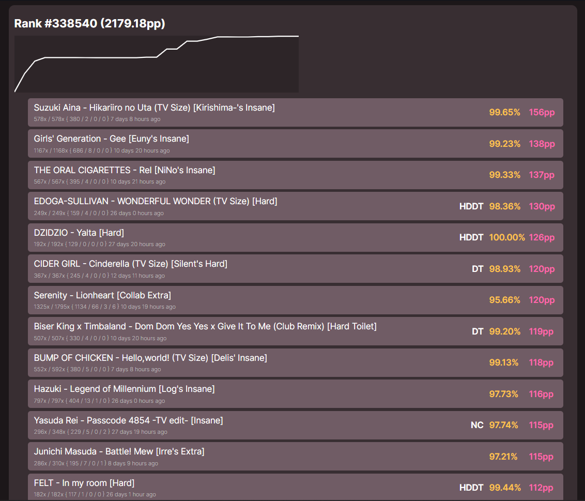

This branch contains some things unique to [kariyu.sheppsu.me](https://kariyu.sheppsu.me).

# osu-score-tracker
Programs for tracking scores and displaying them in website form,
essentially serving as a fresh profile of sorts. Was originally made as an idea to
track Kariyu's left hand top plays on
[kariyu.sheppsu.me](https://kariyu.sheppsu.me). 

# Website
- Index page with top 100 scores, rank, total pp, and graph

- /overlay: Overlay page that shows updated rank in real time

# How to use
- Runs with python (any semi-recent version should be fine).
- Required libraries to run are in requirements.txt (`pip install -r requirements.txt`).
- The programs need a .env file with certain info to run (client variables are oauth credentials from osu profile settings at the bottom):
```
CLIENT_ID=0
CLIENT_SECRET=*****
USER_ID=0
```
- Run create_db.py to create data.db.
- Run update.py while playing the game, which will update data.db.
- To run the website, do `uvicorn server:app`.